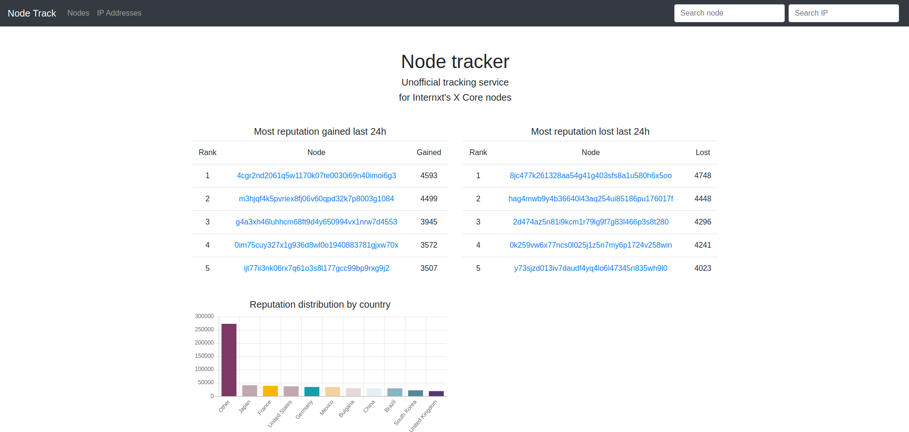
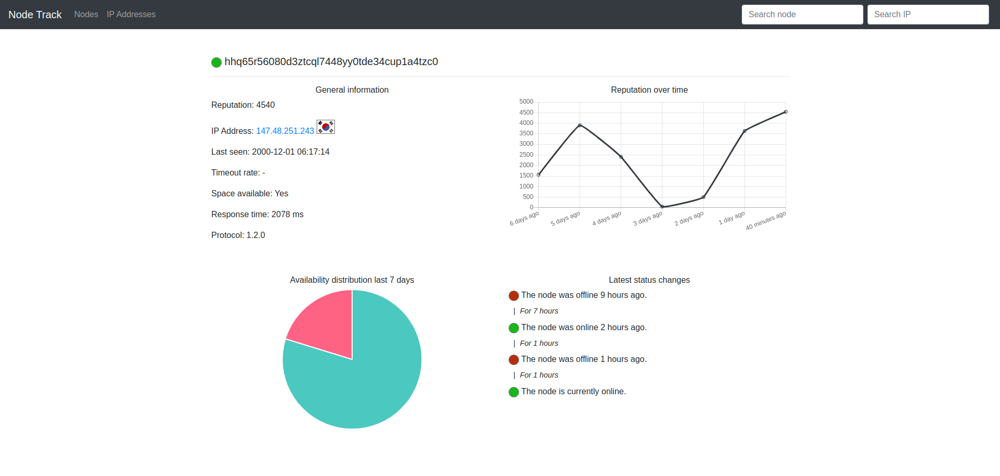
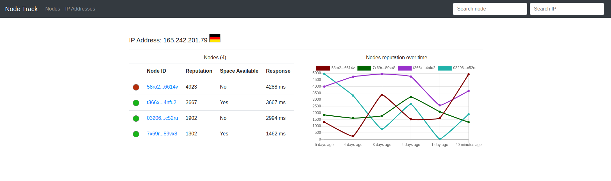
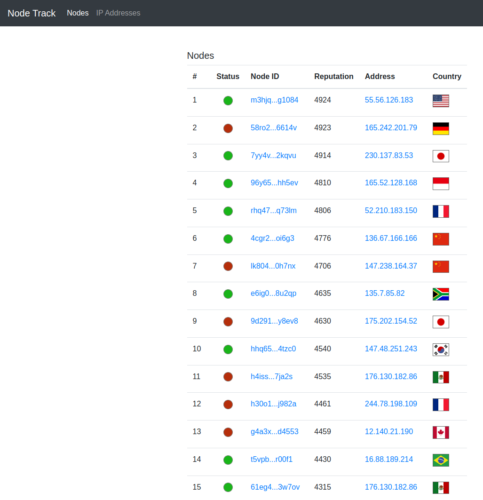
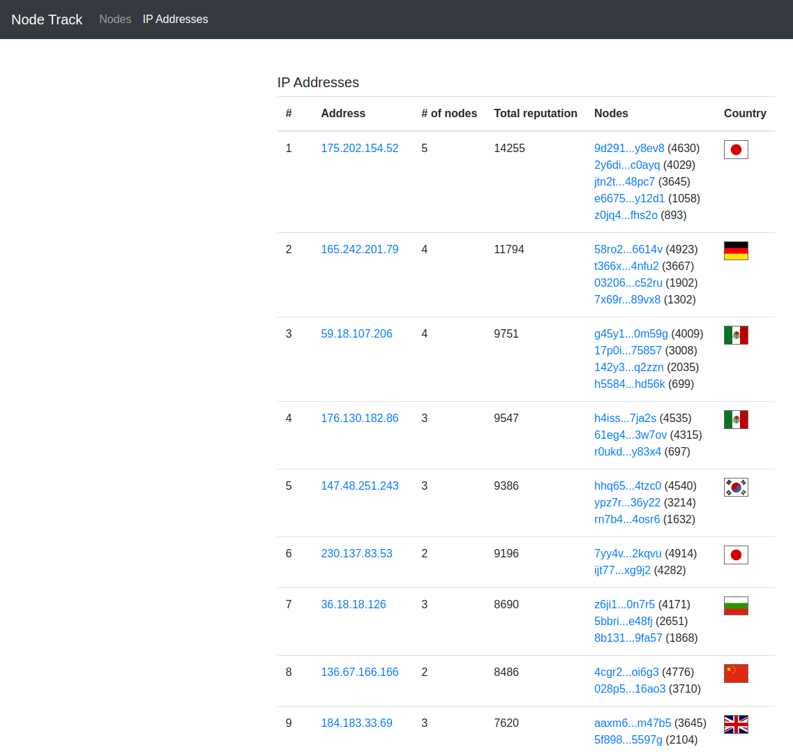

# Internxt Node Tracker

## About

Node tracker is an unofficial third party data miner and collector of the data provided for the nodes, which empower [Internxt](https://internxt.com/)'s decentralized cloud storage service. The official API delivers information only in real time, with no historical records or indication of when a node is not accessible. Node tracker is an attempt to solve those issues, providing easy to use web interface, giving the ability to the node operators to check the status of their server, see past performance via graphs, notify them when an issue occurs. The service is also concerned with the actual amount of decentralization in the network, thus it groups nodes under the same IP address, and tracks their locations for metrics by country/region.

## Tech stack

- PHP 8.1
- Laravel 9
- Backend rendering
- Bootstrap 4
- Docker containerization for local development

## Screenshots

